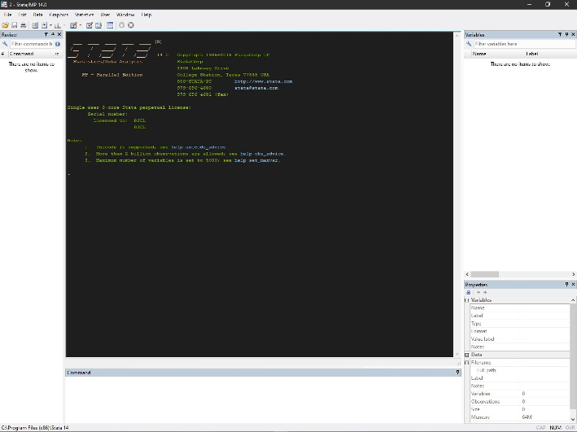
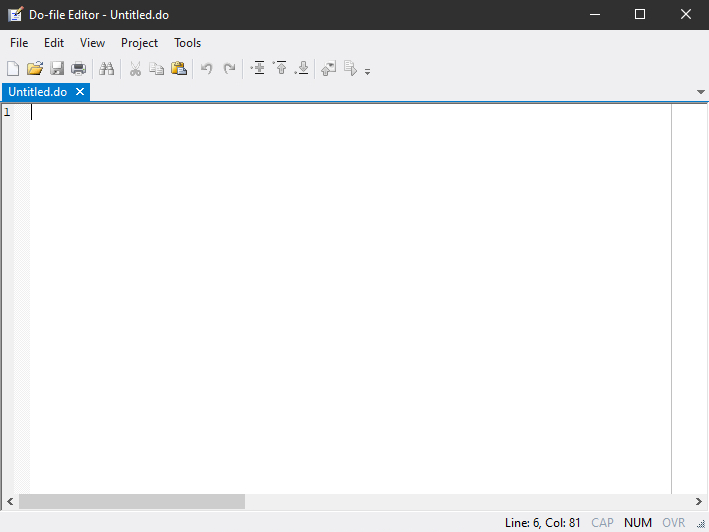
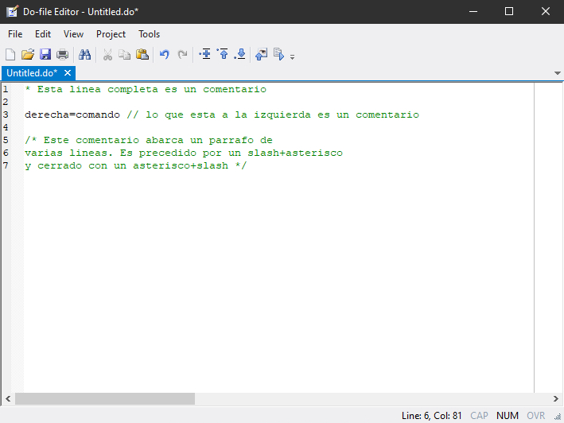
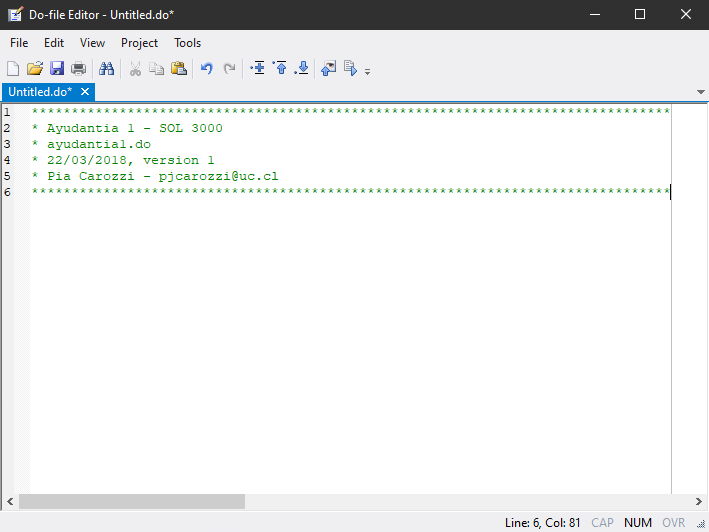

Al abrir Stata, podemos reconocer cuatro ventanas basicas

<ol type="1">
<li>Resultados</li>
<li>Command</li>
<li>Review</li>
<li>Variables y Propiedades</li>
</ol>
<figure>
<figcaption>Figura 1. Interface de usuario</figcaption>
</figure>

Stata es un programa que opera a traves de comandos. Los comandos pueden ser escritos en la ventana <em>Command</em> o ejecutados desde un <em>do-file</em>.

Cuando se ejecuta un comando, los resultados aparecen en la ventana <em>Results</em>.

La ventana <em>Review</em> constituye un historial de comandos, listando todos los comandos que han sido ejecutados durante la sesion en Stata.

Las ventanas <em>Variables</em> y <em>Properties</em> exponen la lista de variables presentes en la base de datos cargada en la memoria del programa y sus propiedades. Cuando no hay una base de datos cargada, estas ventanas no muestran informacion.

Para mantener un registro de todas las operaciones realizadas sobre los datos, utilizaremos un <em>do-file</em>. Abrimos el <em>Do-file Editor</em>, escribiendo <code>doedit</code>en la ventana <em>Command</em> y presionando <em>Enter</em>.

<pre class='stata'>. doedit
</pre>
<figure>
<figcaption>Figura 2. Do-file editor</figcaption>
</figure>

Con esto se abre el <em>do-file editor</em>, por ahora una ventana en blanco que muestra la pestaña <em>untitled.do</em> que identifica el archivo que acabamos de crear.

El <em>do-file editor</em> permite editar los scripts o archivos de ordenes de Stata, llamados <em>do-files</em>.

Usar el do-file para guardar los comandos utilizados constituye una buena practica y sera promovida en este curso. Los do-file nos permitiran registrar ordenadamente el codigo utilizado y con esto el procesamiento realizado sobre los datos. A su vez, este registro posibilita que otros puedan usar el codigo y volver a realizar nuestros analisis de los datos, es decir, que este sea potencialmente reproducible.

Con ambos objetivos en mente (orden y “reproducibilidad”), se recomienda organizar el codigo en secciones y realizar aclaraciones respecto a los que se pretende hacer y cuales son los resultados esperados. El lenguaje de Stata reconoce marcadores especificos como comentarios, es decir, como trozos de texto que no son codigo y por lo tanto no debe ser ejecutado. Insertar estos comentarios nos permite no solo mantener un registro ordenado y reproducible, sino “humanamente” comprensible.

Stata tiene diversas maneras de identificar comentarios

<ol type="1">
<li>Iniciar una linea con *</li>
<li>Ingresar // en una linea</li>
<li>Varias lineas con /*** y ***/</li>
</ol>
<figure>
<figcaption>Figura 3. Comentarios en un do-file</figcaption>
</figure>

Todo lo que ha sido identificado como comentario y reconocido por Stata quedara registrado en el <em>do-file</em> en color verde.

Convencionalmente, las primeras lineas de un <em>do-file</em> incluyen un encabezado que identifica el proyecto, nombre de archivo, la version del programa, fecha, autor y otros datos que se consideren relevantes. Por ejemplo, Ingresamos la siguiente informacion en el <em>do-file</em> recien creado. Como no se trata de comandos, la identificamos como comentario.

<figure>
<figcaption>Figura 4. Encabezado en un do-file</figcaption>
</figure>

Otra convencion es que la primera linea de comando identifique la version de Stata para la cual se escribio el <em>do-file</em>. Esto permite que versiones mas recientes del programa reconozcan los comandos. Si no sabemos con certeza que version estamos usando, usamos <code>version</code>.

<pre class='stata'>. version
version 14.0
</pre>

Volvamos al <em>do-file</em>, y declaramos la version que estamos usando.

<pre class='stata'>. version 14
</pre>

Tambien es recomendable limpiar la memoria del programa, para empezar la sesion desde cero.

<pre class='stata'>. clear all

. macro drop _all

. capture log close
</pre>

Para mantener los archivos localmente ordenados, declaramos una carpeta de trabajo. Stata buscara y guardara los archivos producidos durante la sesion en esta carpeta a menos que se especifique una diferente. Como ejemplo, creemos una carpeta en Desktop.

<pre class='stata'>. mkdir "C:/Users/pjcar/Desktop/ayudantia1"
</pre>

Declaremos esta carpeta como nuestra carpeta de trabajo.

<pre class='stata'>. cd "C:/Users/pjcar/Desktop/ayudantia1"
C:\Users\pjcar\Desktop\ayudantia1
</pre>

La direccion debe ir entre comillas y debe referir a una carpeta existente.

Ejecutemos lo que hemos escrito en nuestro <em>do-file</em>. Seleccionamos los comandos que deseamos ejecutar y presionamos CTRL+D (Command+Shift+D en Mac)

Con esto quedan declarada nuestra carpeta y los comandos iniciales. Verifiquemos los contenidos del directorio de trabajo.

<pre class='stata'>. dir
  &lt;dir>   3/21/19 21:18  .
  &lt;dir>   3/21/19 21:18  ..
</pre>

La carpeta esta vacia. Guardemos en ella el <em>do-file</em> en el que estamos trabajando. Esto debe hacerse a traves de GUI. En la ventana del <em>Do-file Editor</em>, el menu desplegable <em>File</em> contiene la opcion <em>Save as</em>.

Llamemos este archivo “ayudantia1” y cerremos el <em>do-file</em>. Volvamos a checkear los contenidos de la carpeta.

<pre class='stata'>. dir
  &lt;dir>   3/21/19 21:11  .
  &lt;dir>   3/21/19 21:11  ..
   0.1k   3/21/19 20:49  ayudantia1.do
   0.5k   3/21/19 21:11  logayudantia1.smcl
</pre>

OK. Volvamos a abrir <em>ayudantia1.do</em>, esta vez a traves de la ventana <em>Command</em>.

<pre class='stata'>. doedit ayudantia1
</pre>

Los <em>do-file</em> sirven para guardar los comandos, pero no los resultados que van apareciendo en la ventana <em>Results</em>. Para registrar todo el proceso, podemos usar un <em>log file</em>. Los <em>log files</em> son especialemente practicos cuando se ejecutan secciones largas de codigo, porque la ventana <em>Results</em> solo muestra los resultados mas recientes. Los <em>log file</em> no son necesarios, pero son utiles.

Creemos un log file llamado <em>logayudantia1</em>, que tendra por nombre <em>ayudantia</em>

<pre class='stata'>. log using logayudantia1, replace name(ayudantia)
───────────────────────────────────────────────────────────────────────────────────────────────────────────────────────────────────────────────────────────────────────────────
      name:  ayudantia
       log:  C:\Users\pjcar\Desktop\ayudantia1\logayudantia1.smcl
  log type:  smcl
 opened on:  21 March 2019, 21:18:00
</pre>

Los <em>log files</em> se guardan automaticamente bajo la extension <em>.smcl</em>, pero tambien se puede especificar la extension <em>.txt</em>. El archivo ira “grabando” el desarrollo del trabajo hasta que se pida directamente al programa que suspenda el registro o se cierre el log.

<pre class='stata'>. log close ayudantia
      name:  ayudantia
       log:  C:\Users\pjcar\Desktop\ayudantia1\logayudantia1.smcl
  log type:  smcl
 closed on:  21 March 2019, 21:18:00
───────────────────────────────────────────────────────────────────────────────────────────────────────────────────────────────────────────────────────────────────────────────
</pre>
